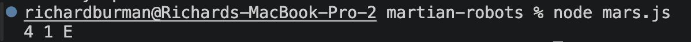
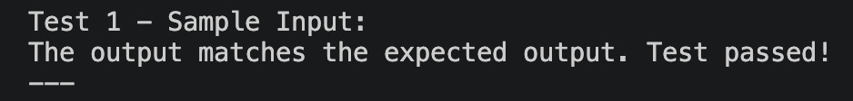
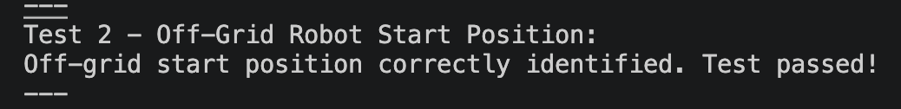
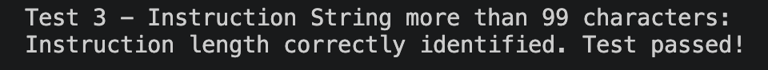

# Martian Robots - Documentation

## Overview
This project is a JavaScript coded solution to the Martian Robots challenge. It simulates robots navigating a rectangular grid on Mars, 
handling movement, boundaries and the scent logic which is required to prevent multiple robots from being lost at the same coordinates. 

### JavaScript
I decided to choose JavaScript to work on this project as it allows for an object-oriented approach while remaining simple and easily readable. It is a 
ideal language to use that most engineers can understand and verify quickly. 

## System Architecture

### The MarsGrid Class
I designed a MarsGrid class to act as the 'Source of Truth' for the robot mission. 

- It stores the grid boundaries of Mars
- The scents left by lost robots

The grid boundaries are set to a max value of 50 for both X, Y. 
By using a single instance of MarsGrid for all of the robots, I ensure that a scent left by any robot is correctly detected by any future robots in that instance. 

Within MarsGrid is moveRobot:

This method handles the execution of instructions for a single robot. 

-  Validation: Before any movement occurs, it validates that the instructions string is under 100 characters and that the robot isn't starting in an 'off-grid' position.
- Mapping: It translates directions (N, S, E, W) into Cartesian movements. Specifically, North corresponds to (x, y +1) as per the requirements.
- Future-Proofing: The movement logic is structured using if/else if chain. This allows the system to be easily extended with new commands, without risking the existing 'Forward' or 'Rotate' logic.
 
## Testing and Verification

I followed a test-driven mindset, verifying the logic at every stage of development. 

### Check 1: Manual Movement Verification

Before the main tests, I implemented manual tests, to verify that the robot could move and rotate correctly, without the overhead of input parser. 

Why: I did this to ensure that the coordinate math was correct. If a robot is at (1,1) East and moves 'Forward' 3 times, it should land at (4,1). Catching these errors early, prevented any issues further down the line. 

```javascript
const testGrid = new MarsGrid(5, 3);
console.log(testGrid.moveRobot(1, 1, 'E', 'FFF'));
```



### Check 2: Sample Input and Scent Logic
I utilised the provided sample data to verify the Scent requirement. 

Why: This test proves that the grid correctly stores a scent when Robot 2 is lost and that Robot 3 successfully detects that scent to avoid the same fate. 

```javascript
// Verification of Sample Input
const finalOutput = runMartianRobots(inputData);
// Expected: 1 1 E, 3 3 N LOST, 2 3 S
```



### Check 3: Boundaries Checks and Constraint Checks

I verified that the system correctly handles edge cases, such as robots starting off-grid or instructions exceeding the 100 character limit. 

Why: Code must be robust against 'bad', 'incorrect' input. These tests ensure the program provide clear feedback rather than failing silently. 




## How to run

- Ensure you have Node.js installed
- Run the script from your terminal: 
``` Bash
node mars.js
```
- The terminal will display the results followed by the verification tests. 

## Comments

I use comments while coding which can be seen and viewed in the commit history to show my thinking and thought process while undertaking this project. 

I have now removed the comments from the code to ensure it is production ready. 